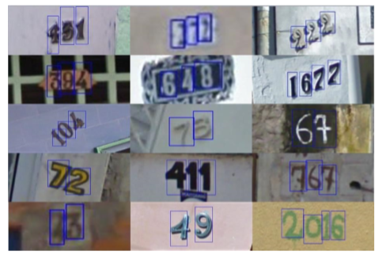
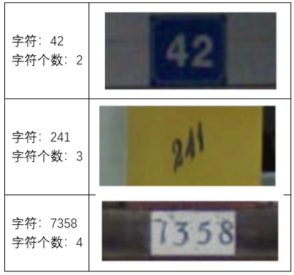
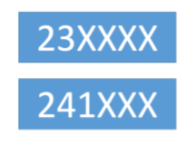
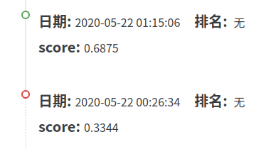

# 天池计算机视觉入门赛:SVHN数据集实战

这里我们以datawhale和天池合作的天池计算机视觉入门赛（TODO:链接）为例，通过案例实战来进一步巩固本章所介绍的图像分类知识。

## 比赛简介与赛题分析

该比赛以SVHN街道字符为赛题数据，数据集报名后可见并可下载，该数据来自收集的SVHN街道字符，并进行了匿名采样处理，详细的介绍见赛事官网。



TODO: 数据集下载链接 ××

注：以下代码均默认已将比赛数据的根文件夹命名为`tianchi_SVHN`并放置于`Dive-into-CV-PyTorch/dataset/tianchi_SVHN`下

我们要做的就是识别图片中的数字串，赛题给定的数据图片中不同图片中包含的字符数量不等，如下图所示。



看起来好像有点棘手，和本章介绍的图像分类还并不一样。这里我们利用一个巧妙的思路，将赛题转化为一个分类问题来解。

赛题数据集大部分图像中字符个数为2-4个，最多的字符个数为6个。因此可以对于所有的图像都抽象为6个字
符的定长字符识别问题，少于6位的部分填充为X。

例如字符23填充为23XXXX，字符231填充为231XXX。



于是相当于将赛题转化为了分别对6个数字进行的分类问题，每个数字预测0-9/X。

注：这种思路显然不是本次比赛以及SVHN数据集的最佳解法，但却十分巧妙，这样设计的实战项目可以巩固对于本章图像分类知识的学习，考察灵活掌握的程度。


## 环境安装

本节所介绍的实战代码对环境有特殊依赖，理论上Python2/3，Pytorch1.x版本均可以跑通。此外，由于数据集较小，有无GPU都是可以的，动手开始实战吧~

下面给出 python3.7 + torch1.3.1-gpu版本的环境安装示例

注：假设你已经安装了Anaconda及CUDA10.0,如果你对环境安装不太了解，请阅读第一章的环境安装部分教程。

首先在Anaconda中创建一个专门用于本次天池联系赛的虚拟环境。

`$ conda create -n py37_torch131 python=3.7`

然后激活环境，并安装gpu版本Pytorch

`$ source activate py37_torch131`

`$ conda install pytorch=1.3.1 torchvision cudatoolkit=10.0`

最后通过下面的命令一键完成其他依赖库的安装。

`$ pip install tqdm pandas matplotlib opencv-python jupyter`


## 阅读baseline

下面我们首先浏览并理解一下Datawhale观察提供的[baseline](https://tianchi.aliyun.com/notebook-ai/detail?spm=5176.12586969.1002.6.2ce832bchtKi75&postId=108342)。

### 首先导入必要的库

```python
# -*- coding: utf-8 -*-                                                                          
import os, sys, glob, shutil, json
os.environ["CUDA_VISIBLE_DEVICES"] = '0'

import cv2
import numpy as np
from PIL import Image

from tqdm import tqdm, tqdm_notebook

%pylab inline

import torch
torch.manual_seed(0)
torch.backends.cudnn.deterministic = False
torch.backends.cudnn.benchmark = True

import torchvision.models as models
import torchvision.transforms as transforms
import torchvision.datasets as datasets
import torch.nn as nn
import torch.nn.functional as F
import torch.optim as optim
from torch.autograd import Variable
from torch.utils.data.dataset import Dataset
```

### 定义读取数据集

```python
class SVHNDataset(Dataset):
    def __init__(self, img_path, img_label, transform=None):
        self.img_path = img_path
        self.img_label = img_label
        if transform is not None:
            self.transform = transform
        else:
            self.transform = None

    def __getitem__(self, index):
        img = Image.open(self.img_path[index]).convert('RGB')

        if self.transform is not None:
            img = self.transform(img)

        lbl = np.array(self.img_label[index], dtype=np.int)
        lbl = list(lbl)  + (5 - len(lbl)) * [10]
        return img, torch.from_numpy(np.array(lbl[:5]))

    def __len__(self):
        return len(self.img_path)

```

### 定义读取数据dataloader

```python
train_path = glob.glob('../../../dataset/tianchi_SVHN/train/*.png')
train_path.sort()
train_json = json.load(open('../../../dataset/tianchi_SVHN/train.json'))
train_label = [train_json[x]['label'] for x in train_json]
print(len(train_path), len(train_label))

train_loader = torch.utils.data.DataLoader(
    SVHNDataset(train_path, train_label,
                transforms.Compose([
                    transforms.Resize((64, 128)),
                    transforms.RandomCrop((60, 120)),
                    transforms.ToTensor(),
                    transforms.Normalize([0.485, 0.456, 0.406], [0.229, 0.224, 0.225])
    ])),
    batch_size=40,
    shuffle=True,
    num_workers=10,
)

val_path = glob.glob('../../../dataset/tianchi_SVHN/val/*.png')
val_path.sort()
val_json = json.load(open('../../../dataset/tianchi_SVHN/val.json'))
val_label = [val_json[x]['label'] for x in val_json]
print(len(val_path), len(val_label))

val_loader = torch.utils.data.DataLoader(
    SVHNDataset(val_path, val_label,
                transforms.Compose([
                    transforms.Resize((60, 120)),
                    transforms.ToTensor(),
                    transforms.Normalize([0.485, 0.456, 0.406], [0.229, 0.224, 0.225])
    ])),
    batch_size=40,
    shuffle=False,
    num_workers=10,
)
```

```
30000 30000
10000 10000
```

通过上述代码, 定义了赛题图像数据和对应标签的读取器dataloader。后面实际进行训练时，dataloader会根据我们代码中的定义，进行在线的数据増广，数据扩增的效果如下所示：


### 定义分类模型

这里使用ResNet18模型进行特征提取

```python
class SVHN_Model1(nn.Module):
    def __init__(self):
        super(SVHN_Model1, self).__init__()

        model_conv = models.resnet18(pretrained=True)
        model_conv.avgpool = nn.AdaptiveAvgPool2d(1)
        model_conv = nn.Sequential(*list(model_conv.children())[:-1])
        self.cnn = model_conv

        self.fc1 = nn.Linear(512, 11)
        self.fc2 = nn.Linear(512, 11)
        self.fc3 = nn.Linear(512, 11)
        self.fc4 = nn.Linear(512, 11)
        self.fc5 = nn.Linear(512, 11)

    def forward(self, img):
        feat = self.cnn(img)
        # print(feat.shape)
        feat = feat.view(feat.shape[0], -1)
        c1 = self.fc1(feat)
        c2 = self.fc2(feat)
        c3 = self.fc3(feat)
        c4 = self.fc4(feat)
        c5 = self.fc5(feat)
        return c1, c2, c3, c4, c5
```

```python
def train(train_loader, model, criterion, optimizer):
    # 切换模型为训练模式
    model.train()
    train_loss = []

    for i, (input, target) in enumerate(train_loader):
        if use_cuda:
            input = input.cuda()
            target = target.cuda()

        c0, c1, c2, c3, c4 = model(input)
        loss = criterion(c0, target[:, 0]) + \
                criterion(c1, target[:, 1]) + \
                criterion(c2, target[:, 2]) + \
                criterion(c3, target[:, 3]) + \
                criterion(c4, target[:, 4])

        optimizer.zero_grad()
        loss.backward()
        optimizer.step()

        train_loss.append(loss.item())
    return np.mean(train_loss)

def validate(val_loader, model, criterion):
    # 切换模型为预测模型
    model.eval()
    val_loss = []

    # 不记录模型梯度信息
    with torch.no_grad():
        for i, (input, target) in enumerate(val_loader):
            if use_cuda:
                input = input.cuda()
                target = target.cuda()

            c0, c1, c2, c3, c4 = model(input)
            loss = criterion(c0, target[:, 0]) + \
                    criterion(c1, target[:, 1]) + \
                    criterion(c2, target[:, 2]) + \
                    criterion(c3, target[:, 3]) + \
                    criterion(c4, target[:, 4])
            val_loss.append(loss.item())
    return np.mean(val_loss)

def predict(test_loader, model, tta=10):
    model.eval()
    test_pred_tta = None

    # TTA 次数
    for _ in range(tta):
        test_pred = []

        with torch.no_grad():
            for i, (input, target) in enumerate(test_loader):
                if use_cuda:
                    input = input.cuda()

                c0, c1, c2, c3, c4 = model(input)
                if use_cuda:
                    output = np.concatenate([
                        c0.data.cpu().numpy(),
                        c1.data.cpu().numpy(),
                        c2.data.cpu().numpy(),
                        c3.data.cpu().numpy(),
                        c4.data.cpu().numpy()], axis=1)
                else:
                    output = np.concatenate([
                        c0.data.numpy(),
                        c1.data.numpy(),
                        c2.data.numpy(),
                        c3.data.numpy(),
                        c4.data.numpy()], axis=1)

                test_pred.append(output)

        test_pred = np.vstack(test_pred)
        if test_pred_tta is None:
            test_pred_tta = test_pred
        else:
            test_pred_tta += test_pred

    return test_pred_tta
```


### 训练与验证

```python
model = SVHN_Model1()
criterion = nn.CrossEntropyLoss()
optimizer = torch.optim.Adam(model.parameters(), 0.001)

use_cuda = True
if use_cuda:
    model = model.cuda()

best_loss = 1000.0
for epoch in range(3):
    train_loss = train(train_loader, model, criterion, optimizer)
    val_loss = validate(val_loader, model, criterion)
    
    val_label = [''.join(map(str, x)) for x in val_loader.dataset.img_label]
    val_predict_label = predict(val_loader, model, 1)
    val_predict_label = np.vstack([
        val_predict_label[:, :11].argmax(1),
        val_predict_label[:, 11:22].argmax(1),
        val_predict_label[:, 22:33].argmax(1),
        val_predict_label[:, 33:44].argmax(1),
        val_predict_label[:, 44:55].argmax(1),
    ]).T
    val_label_pred = []
    for x in val_predict_label:
        val_label_pred.append(''.join(map(str, x[x!=10])))
    
    val_char_acc = np.mean(np.array(val_label_pred) == np.array(val_label))
    
    print('Epoch: {0}, Train loss: {1} \t Val loss: {2} \t Val Acc: {3}'.format(epoch, train_loss, val_loss, val_char_acc))

    # 记录下验证集精度
    if val_loss < best_loss:
        best_loss = val_loss
        # print('Find better model in Epoch {0}, saving model.'.format(epoch))
        torch.save(model.state_dict(), './model.pt')
```

```
Epoch: 0, Train loss: 3.2353286933898926 	 Val loss: 3.518701043128967 	 Val Acc: 0.3391
Epoch: 1, Train loss: 1.99197505068779 	     Val loss: 2.9245959606170655 	 Val Acc: 0.4436
...
...
```

### 预测并生成提交文件

```python
test_path = glob.glob('../../../dataset/tianchi_SVHN/test_a/*.png')
test_path.sort()
test_label = [[1]] * len(test_path)
print(len(test_path), len(test_label))

test_loader = torch.utils.data.DataLoader(
    SVHNDataset(test_path, test_label,
                transforms.Compose([
                    transforms.Resize((70, 140)),
                    transforms.ToTensor(),
                    transforms.Normalize([0.485, 0.456, 0.406], [0.229, 0.224, 0.225])
    ])),
    batch_size=40,
    shuffle=False,
    num_workers=10,
)
```

```
40000 40000
```

```python
# 加载保存的最优模型生成提交文件
model.load_state_dict(torch.load('model.pt'))

test_predict_label = predict(test_loader, model, 1)
print(test_predict_label.shape)

test_label = [''.join(map(str, x)) for x in test_loader.dataset.img_label]
test_predict_label = np.vstack([
    test_predict_label[:, :11].argmax(1),
    test_predict_label[:, 11:22].argmax(1),
    test_predict_label[:, 22:33].argmax(1),
    test_predict_label[:, 33:44].argmax(1),
    test_predict_label[:, 44:55].argmax(1),
]).T

test_label_pred = []
for x in test_predict_label:
    test_label_pred.append(''.join(map(str, x[x!=10])))

import pandas as pd
df_submit = pd.read_csv('../../../dataset/tianchi_SVHN/test_A_sample_submit.csv')
df_submit['file_code'] = test_label_pred
df_submit.to_csv('submit.csv', index=None)  
```

```
(40000, 55)
```

## 调参实战

首先让我们快速确定baseline的几个基础参数

### 学习率调整

首先快速确定初始学习率，以及学习率调整策略

初始学习率判断标准：训练初期loss快速下降

我们先以0.01作为初始学习率，训练几个epoch

```
Epoch: 0, Train loss: 3.201288181463877 	 Val loss: 3.6346988077163696 	 Val Acc: 0.3234
Epoch: 1, Train loss: 1.9820853635470073 	 Val loss: 3.010792998790741 	 Val Acc: 0.44
Epoch: 2, Train loss: 1.6244886504809062 	 Val loss: 2.765939730644226 	 Val Acc: 0.4758
Epoch: 3, Train loss: 1.4178793375492096 	 Val loss: 2.6497371077537535 	 Val Acc: 0.5069
Epoch: 4, Train loss: 1.2603404329617818 	 Val loss: 2.716396602153778 	 Val Acc: 0.4849
Epoch: 5, Train loss: 1.1504622252782186 	 Val loss: 2.5561904258728028 	 Val Acc: 0.5357
Epoch: 6, Train loss: 1.04843408370018 	     Val loss: 2.5777493786811827 	 Val Acc: 0.5415
Epoch: 7, Train loss: 0.9496217265923818 	 Val loss: 2.524811834573746 	 Val Acc: 0.5326
Epoch: 8, Train loss: 0.8733580025633176 	 Val loss: 2.6108505029678346 	 Val Acc: 0.5505
Epoch: 9, Train loss: 0.7865098938941956 	 Val loss: 2.607123359680176 	 Val Acc: 0.5523
best val acc: 0.5523
```

可以看到，训练初期loss快速下降，所以0.01作为初始学习率是合适的。

训练中，学习率是可以进行调整的，一种常用的方法是阶段性学习率衰减策略。

在上面尝试性的训练过程中，可以看到，验证集loss在10个epoch左右下降趋势已不明显，因此可以尝试在第10个epoch，将学习率衰减为原来的10%。按照这样的学习率调整策略，我们训练20个epoch看下：


```
Epoch: 0, Train loss: 3.217955897013346 	 Val loss: 3.4973887462615965 	 Val Acc: 0.3428
Epoch: 1, Train loss: 1.9865643223921459 	 Val loss: 3.041480797290802 	 Val Acc: 0.4252
Epoch: 2, Train loss: 1.6422564171155294 	 Val loss: 2.734321162700653 	 Val Acc: 0.4845
Epoch: 3, Train loss: 1.4109662581682205 	 Val loss: 2.6289015769958497 	 Val Acc: 0.5124
Epoch: 4, Train loss: 1.268737798611323 	 Val loss: 2.6607061581611635 	 Val Acc: 0.5025
Epoch: 5, Train loss: 1.149802592118581 	 Val loss: 2.693304219722748 	 Val Acc: 0.5122
Epoch: 6, Train loss: 1.0440267440478006 	 Val loss: 2.5291405525207518 	 Val Acc: 0.5363
Epoch: 7, Train loss: 0.9582021673123042 	 Val loss: 2.64508363032341 	 Val Acc: 0.5167
Epoch: 8, Train loss: 0.8617052629590034 	 Val loss: 2.5092941007614136 	 Val Acc: 0.5473
Epoch: 9, Train loss: 0.7965546736717224 	 Val loss: 2.4935685346126557 	 Val Acc: 0.5429
Epoch: 10, Train loss: 0.47227135149141153 	 Val loss: 2.3851090211868287 	 Val Acc: 0.5987
Epoch: 11, Train loss: 0.356143202851216 	 Val loss: 2.458720991849899 	 Val Acc: 0.603
Epoch: 12, Train loss: 0.3016581511025627 	 Val loss: 2.5575384349822996 	 Val Acc: 0.6012
Epoch: 13, Train loss: 0.26212659483402967 	 Val loss: 2.7137050013542177 	 Val Acc: 0.5975
Epoch: 14, Train loss: 0.22160522095113994 	 Val loss: 2.834437639474869 	 Val Acc: 0.6031
Epoch: 15, Train loss: 0.1934196574985981 	 Val loss: 3.015086229324341 	 Val Acc: 0.5971
Epoch: 16, Train loss: 0.16129128922770422 	 Val loss: 3.131588038921356 	 Val Acc: 0.601
Epoch: 17, Train loss: 0.14016953054318826 	 Val loss: 3.417837708234787 	 Val Acc: 0.5923
Epoch: 18, Train loss: 0.12422899308552345 	 Val loss: 3.5185752115249636 	 Val Acc: 0.5991
Epoch: 19, Train loss: 0.09977891861026486 	 Val loss: 3.5448452734947207 	 Val Acc: 0.6027
best val acc: 0.6031
```

可以看到，这样的策略将验证集准确率大幅提高到了0.6031 :rocket:

### bug排查

我们已经在线下的验证集将准确率做到了0.6，于是我们可以尝试第一次提交了。



0.33分。。。翻车了

相信用过baseline的小伙伴们都经历过0.3-0.4左右分数的绝望，让我们来看看哪里出了问题。

核心是要抓主要矛盾。

目前的问题是验证集和测试集的准确率存在很大的误差，通常这说明验证集和测试集存在一定的差异。

由于这是个比赛，数据集都是官方提供的，那这种差异是不是我们自己代码的隐性bug带来的呢？

我们观察代码，会发现，训练和测试的dataloader中resize部分是存在不一致的

```
train_loader = torch.utils.data.DataLoader(
    SVHNDataset(train_path, train_label,
                transforms.Compose([
                    transforms.Resize((64, 128)),
                    transforms.RandomCrop((60, 120)),
                    transforms.ToTensor(),
                    transforms.Normalize([0.485, 0.456, 0.406], [0.229, 0.224, 0.225])
    ])),
    batch_size=40,
    shuffle=True,
    num_workers=10,
)

...

test_loader = torch.utils.data.DataLoader(
    SVHNDataset(test_path, test_label,
                transforms.Compose([
                    transforms.Resize((70, 140)),
                    transforms.ToTensor(),
                    transforms.Normalize([0.485, 0.456, 0.406], [0.229, 0.224, 0.225])
    ])),
    batch_size=40,
    shuffle=False,
    num_workers=10,
)
```

图像的输入尺寸是不一致的，而且差异不小，相当于人为引入了验证集和测试集之间的差异。

因此我们将`test_loader`调整为

```
test_loader = torch.utils.data.DataLoader(
    SVHNDataset(test_path, test_label,
                transforms.Compose([
                    transforms.Resize((60, 120)),   # TODO: modify here
                    transforms.ToTensor(),
                    transforms.Normalize([0.485, 0.456, 0.406], [0.229, 0.224, 0.225])
    ])),
    batch_size=40,
    shuffle=False,
    num_workers=10,
)
```

这个bug修复后，成绩一下就能达到0.7左右的水平，我提交的分数是0.7319 :rocket:

### 数据增强策略

我们观察上面的训练日志可以发现，训练集loss可以达到非常低的水平，但是验证集做不到，因此目前的主要矛盾变成了过拟合。


```
...
Epoch: 17, Train loss: 0.14016953054318826 	 Val loss: 3.417837708234787 	 Val Acc: 0.5923
Epoch: 18, Train loss: 0.12422899308552345 	 Val loss: 3.5185752115249636 	 Val Acc: 0.5991
Epoch: 19, Train loss: 0.09977891861026486 	 Val loss: 3.5448452734947207 	 Val Acc: 0.6027
best val acc: 0.6031
```

于是数据增强就成了目前最有可能提分的武器之一。

上面的baseline中我们在训练过程中仅仅使用了RandomCrop作为数据增强,下面我们尝试在训练集中使用更多的数据增强方法，并验证效果。

我们尝试加上一些颜色空间的变换

```
train_loader = torch.utils.data.DataLoader(
    SVHNDataset(train_path, train_label,
                transforms.Compose([
                    transforms.Resize((64, 128)),
                    transforms.RandomCrop((60, 120)),
                    transforms.ColorJitter(0.3, 0.3, 0.2),   # TODO: new add
                    transforms.ToTensor(),
                    transforms.Normalize([0.485, 0.456, 0.406], [0.229, 0.224, 0.225])
    ])),
    batch_size=40,
    shuffle=True,
    num_workers=10,
)
```

重新训练并提交后，得到了0.7453的分数，又上涨了一些。:rocket:

你还可以继续尝试其他的数据增强方法，以及调整其他的参数，这里就不介绍了。

核心就是注意把握两点：

- 抓主要矛盾，确保你现在的实验是在解决目前面临的主要问题，而不是一些无关痛痒的尝试。

- 遵循单一变量原则进行实验。

相信通过本文的介绍，你已经了解了调参的基本方法和思路。

开始自己动手实验吧，Good Luck~


---

--- ***By: 安晟***

>一只普通的算法攻城狮，邮箱[anshengmath@163.com]，[CSDN博客](https://blog.csdn.net/u011583927)，[Github](https://github.com/monkeyDemon)


**关于Datawhale**：

>Datawhale是一个专注于数据科学与AI领域的开源组织，汇集了众多领域院校和知名企业的优秀学习者，聚合了一群有开源精神和探索精神的团队成员。Datawhale以“for the learner，和学习者一起成长”为愿景，鼓励真实地展现自我、开放包容、互信互助、敢于试错和勇于担当。同时Datawhale 用开源的理念去探索开源内容、开源学习和开源方案，赋能人才培养，助力人才成长，建立起人与人，人与知识，人与企业和人与未来的联结。
 

